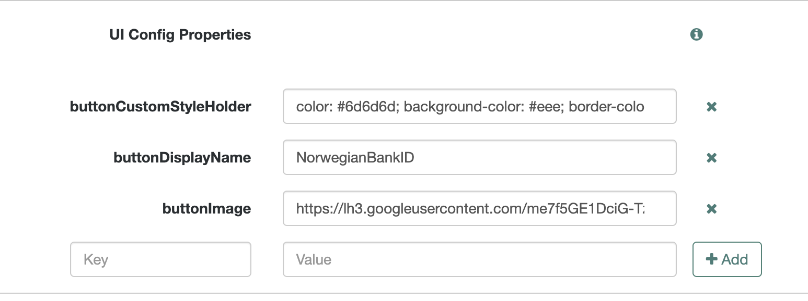
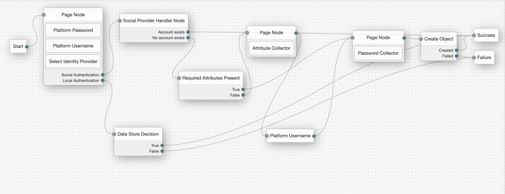
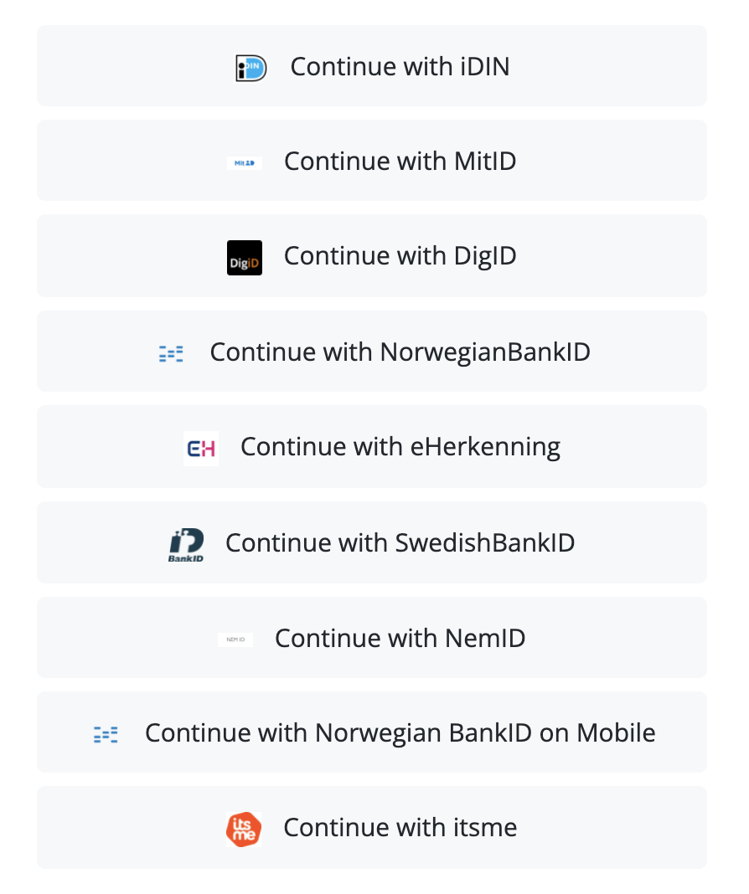
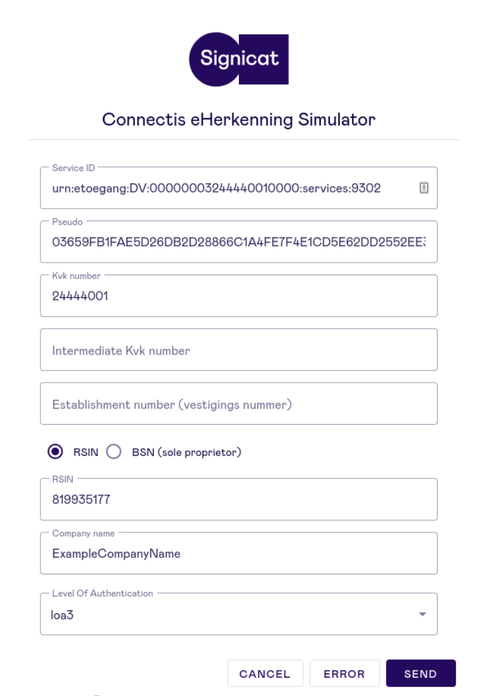
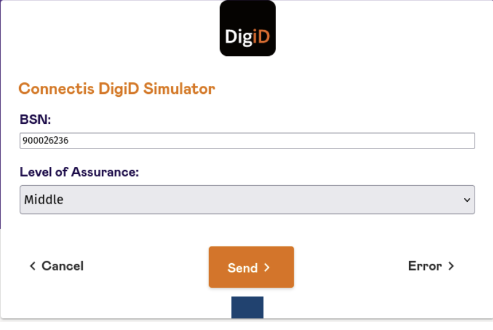

# Signicat Documentation
## Normalization Script
1.) Under the  “Native Consoles” tab open “Access Management”  
2.) Select the Realm > Scripts > +New Script  
3.) Name the Script(i.e “Signicat Profile Normalization”) > Script Type > Social Identity Profile Transformation  
4.) Set language to “Groovy”  
5.) Paste the following code snippet into the Script field:   
                  
        import static org.forgerock.json.JsonValue.field
        import static org.forgerock.json.JsonValue.json
        import static org.forgerock.json.JsonValue.object

        return json(object(
        field("id", rawProfile.sub),
        field("displayName", rawProfile.name),
        field("givenName", rawProfile.given_name),
        field("familyName", rawProfile.family_name ),
        field("fr-attr-str1", rawProfile.signicat.national_id),
        field("email", rawProfile.email),
        field("username", rawProfile.email)))

## Configure idPs
Services > Social Identity Provider Service > Secondary Configurations > Add a Secondary Configuration > Select “Client configuration for provider that implement   
Open ID Connect specifications” Fill out the fields within “New oidcConfig configuration” according to the following. If not indicated, leave the field blank. 
                             
### 1.) Norwegian BankID | Market Coverage: Norway

Auth ID Key: sub  
Client ID: TBD(to be inserted per customer once customer has signed contract)  
Authentication Endpoint URL: https://eu01.signicat.com/oidc/authorize  
Access Token Endpoint URL: https://eu01.signicat.com/oidc/token  
User Profile Service URL: https://eu01.signicat.com/oidc/userinfo  
Redirect URL: TBD(to be inserted per customer once customer has signed contract)  
Scope Delimiter: Put a single space (“ “)  
OAuth Scopes: openid, profile, signicat.national_id make sure that these items are not space nor comma separated, but added as separate items.  
ACR Values: urn:signicat:oidc:method:nbid  
Well Known Endpoint: https://eu01.signicat.com/oidc/.well-known/openid-configuration  
Issuer: https://eu01.signicat.com/oidc   
JWKS URI Endpoint:https://eu01.signicat.com/oidc/jwks.json  
UI Config Properties:  
	
Create following keys and corresponding values:
	
buttonImage > https://lh3.googleusercontent.com/me7f5GE1DciG-TzeV8U5g8qg8-bTKjjy4E8D-GQvMYxKa3WC90btokFC6JsEhid_SnBE9zVelUXp4Jc4GFnfumH3OvpWDkQmJLg-4rb39HO6StQKSB7VaUGVoe9JZu3JBBf3VoQn-fp0nOkl4u14A9vPOl5-QeY2YP41ARv1BamG8JY_k9hn6O8uWbt4JWUswHTfiKSBmCnarcEaOmD-LgiJ_kxr2yuNZY19zl4qczrIQDD0gdHDWetXnCok0_fITUiFiVHP9knECb0CEP2jNC8PjL00B1WsOMNahytB7OSVkugjvt4qgy_7zdslVkKN6ccL_KdD3yi3YpntOg9GSNEnReRCIRuxouvLKU_BASuYpac_XZqaiqqVjtwWTYp8IMvhEF3TQHuyaDuK8rLsxvibTTtA6-9Kz3hNxdGMN4pUkxfHms9l5OTOmFm86tOus6iEf77-QpylFfZm_AVuxCV7ahTKocyLpaHUZcCfWvR1I6dZyovLQmUEOJKAj7v4I5v3icii93LI2ZH-skYbg1fuOBZA-rxTkiXWItqAgZc7s65Rnjwfx2zA9dHJs6hUa_lrkwABLaUfpFeY44qcQNSWWDsyEMg1zKtkA8g1EtgUvHsHFoUVFqJlx81VsVc_54SPrFEUOLTOuUuhQY0kV89VvYHcmy8tw9Y1OGV3Os6-I_0DJmgVXjDQ60pM-jCCQWQgoqFjNYrgeBnSUnvSmg=w580-h345-no?authuser=0  
buttonDisplayName > NorwegianBankID  
buttonCustomStyleHolder > color: #6d6d6d; background-color: #eee;  border-color: #ccc;  

	

Transform Script: Select the script created in Step 1  
Click “Create”   

Once configuration is created, additional fields will be added. Fill out the following:   
Client Secret: <to be inserted per customer once customer has signed contract>  
Client Authentication Method: CLIENT_SECRET_BASIC  
PKCE Method: S256  
Enable Native Nonce: Enabled  
User Info Response Format: JSON  

### 2.) Norwegian BankID Mobile | Market Coverage: Norway
Auth ID Key: sub   Client ID: TBD(to be inserted per customer once customer has signed contract)  
Authentication Endpoint URL:https://eu01.signicat.com/oidc/authorize   
Access Token Endpoint URL: https://eu01.signicat.com/oidc/token   
User Profile Service URL: https://eu01.signicat.com/oidc/userinfo   
Redirect URL: TBD(to be inserted per customer once customer has signed contract)  
Scope Delimiter: Put a single space (“ “)  
OAuth Scopes: openid, profile, signicat.national_id make sure that these items are not space or comma separated, but added as separate items.   
ACR Values: urn:signicat:oidc:method:nbid-mobil  
Well Known Endpoint: https://eu01.signicat.com/oidc/.well-known/openid-configuration  
Issuer: https://eu01.signicat.com/oidc   
JWKS URI Endpoint: https://eu01.signicat.com/oidc/jwks.json   
UI Config Properties:  
Create following keys and corresponding values:  
buttonImage > https://lh3.googleusercontent.com/me7f5GE1DciG-TzeV8U5g8qg8-bTKjjy4E8D-GQvMYxKa3WC90btokFC6JsEhid_SnBE9zVelUXp4Jc4GFnfumH3OvpWDkQmJLg-4rb39HO6StQKSB7VaUGVoe9JZu3JBBf3VoQn-fp0nOkl4u14A9vPOl5-QeY2YP41ARv1BamG8JY_k9hn6O8uWbt4JWUswHTfiKSBmCnarcEaOmD-LgiJ_kxr2yuNZY19zl4qczrIQDD0gdHDWetXnCok0_fITUiFiVHP9knECb0CEP2jNC8PjL00B1WsOMNahytB7OSVkugjvt4qgy_7zdslVkKN6ccL_KdD3yi3YpntOg9GSNEnReRCIRuxouvLKU_BASuYpac_XZqaiqqVjtwWTYp8IMvhEF3TQHuyaDuK8rLsxvibTTtA6-9Kz3hNxdGMN4pUkxfHms9l5OTOmFm86tOus6iEf77-QpylFfZm_AVuxCV7ahTKocyLpaHUZcCfWvR1I6dZyovLQmUEOJKAj7v4I5v3icii93LI2ZH-skYbg1fuOBZA-rxTkiXWItqAgZc7s65Rnjwfx2zA9dHJs6hUa_lrkwABLaUfpFeY44qcQNSWWDsyEMg1zKtkA8g1EtgUvHsHFoUVFqJlx81VsVc_54SPrFEUOLTOuUuhQY0kV89VvYHcmy8tw9Y1OGV3Os6-I_0DJmgVXjDQ60pM-jCCQWQgoqFjNYrgeBnSUnvSmg=w580-h345-no?authuser=0  
buttonDisplayName > Norwegian BankID Mobile  
buttonCustomStyleHolder > color: #6d6d6d; background-color: #eee;  border-color: #ccc;  

Transform Script: Select the script created in Step 1  
Click “Create”   

Once configuration is created, additional fields will be added. Fill out the following:   
Client Secret: <to be inserted per customer once customer has signed contract>  
Client Authentication Method: CLIENT_SECRET_BASIC  
PKCE Method: S256  
Enable Native Nonce: Enabled  
User Info Response Format: JSON  

### 3.) iDIN | Market Coverage: The Netherlands 
Auth ID Key: sub  
Client ID: <to be inserted per customer once customer has signed contract>  
Authentication Endpoint URL: https://eu01.signicat.com/oidc/authorize  
Access Token Endpoint URL: https://eu01.signicat.com/oidc/token   
User Profile Service URL: https://eu01.signicat.com/oidc/userinfo   
Redirect URL: <to be inserted per customer once customer has signed contract>  
Scope Delimiter: Put a single space (“ “)   
OAuth Scopes: openid, profile, signicat.idin, signicat.national_id make sure that these items are not space or comma separated, but added as separate items.   
ACR Values: urn:signicat:oidc:method:idin-ident  
Well Known Endpoint: https://eu01.signicat.com/oidc/.well-known/openid-configuration  
Issuer: https://eu01.signicat.com/oidc   
JWKS URI Endpoint: https://eu01.signicat.com/oidc/jwks.json   
UI Config Properties:  
Create following keys and corresponding values:  
buttonImage > https://lh3.googleusercontent.com/RVexAHF07dTuojYLmJ-oKx52EYr6RqwR6xkC5FgbhHDO0rjppjXllNOW7Au8aI21h6M8hb82BXuWtQ6q9KFnRzDTOVWgjdsCmKVc6WvnfRl761drgDWHeAyI1-sFM7nP03UdBELEz8vgwMVElRzXevHqVqNrU37e32bbnBAWTzfW8UuMb5ARlpxqySKKkS8ErZolPyZL9Cvnq6QXadBXkgomzjR5GpFNDIVNM1dWprQYKKEMr7Lp0EPEAB0r-DcHnJYoh3nrJnv3sCzrNuK-h0gcHxBFmKSHaCu-nKydX0pzj2aPDBRAcX_jJK6x5otOt6YDaSPcdnbevAbehQYH1yHOniP3NzggAoDqnQY8Kty0iXmkHIoHRqaEsgdNGNFHW5uFe8aaz4AvtUfRkrfR6O-gB880vU9WZcn23rQxK-bS7IcPzrSZmbEv3Nc8hMZxQYgvUgPhWgKNBHn_6FSw-XdSdw73XOrurP658gSUPJSgbBuJGzBGtfNQQZvZbCJ1wkrJwEwQnbpvGgUy5GQ-IU1c4ONVFrK7lREgcHi_4cHhlExEJ0kodH5M_FwmcwwQzWuNT1Jl4OjkE4kKi7GFq5eLhhqpsMEgZ1tTLKRWif6oJ6ZMrhGcMl37cYpF_et1bT_sy_9fKz9f_wRu_DVlsH8l9BfSS0B09EN40dkzU9c7ovNjYqH43aOlz6dv9y1mhUheY3wzyn82Hc691zEKOg=w1024-h903-no?authuser=0  
buttonDisplayName > iDIN  
buttonCustomStyleHolder > color: #6d6d6d; background-color: 
#eee;  border-color: #ccc;  
Transform Script: Select the script created in Step 1  
Click “Create”   

Once configuration is created, additional fields will be added. Fill out the following:   
Client Secret: <to be inserted per customer once customer has signed contract>  
Client Authentication Method: CLIENT_SECRET_BASIC  
PKCE Method: S256  
Enable Native Nonce: Enabled  
User Info Response Format: JSON  

### 4.) Swedish BankID | Market Coverage: Sweden 
Auth ID Key: sub  
Client ID: <to be inserted per customer once customer has signed contract>  
Authentication Endpoint URL: https://eu01.signicat.com/oidc/authorize   
Access Token Endpoint URL: https://eu01.signicat.com/oidc/token   
User Profile Service URL: https://eu01.signicat.com/oidc/userinfo   
Redirect URL: <to be inserted per customer once customer has signed contract>  
Scope Delimiter: Put a single space (“ “)  
OAuth Scopes:openid, profile, signicat.national_id make sure that these items are not space or comma separated, but added as separate items.   
ACR Values:urn:signicat:oidc:method:sbid  
Well Known Endpoint: https://eu01.signicat.com/oidc/.well-known/openid-configuration  
Issuer: https://eu01.signicat.com/oidc   
JWKS URI Endpoint: https://eu01.signicat.com/oidc/jwks.json   
UI Config Properties:  
Create following keys and corresponding values:  
buttonImage > https://lh3.googleusercontent.com/-g4A7p_0YvM-fiOkVzEbUvqhW1E4tNu5lR6HT3i7UBhWzXRJo3s6lXCzzc5xk0o-OwftGSqDtDRjYlGRbdxLIcrj2Ndg0ybNdnP0JGR40al43fqXhfXmNlgoOC88B6VNrhmM_pVusKN6yNcdmbAO72YCQvfTgqjBmbJMBZCwN_hnPOp5CqkmOjCHXo96CzocKz1DCzPsL7kCD0nwizLkt6WQKgJdFmXonblps5j184PCBkx8qWpssuVRgsx7zNsyC1kS4fq4f-2LABC66AyHnHexa-lMev_yzUh6RYwRo8EvYutQ69LNisPnN7CnsDnSPBLPXzzb2IKzi1q3yO9jF51nPnA-iXrRGO1fUX6xakiBGIWK6OHIiMAY7MPzeibApyUWMHFmMksDTafjlxbJNWJpy4nLZ_4G_hl7GJ_Mffw0m1yfAULf_2uSM1PvOF4IPx-pW4jL6YVX-CbkQCJv4-iOx67cfXDvbixcsSK9pD9pu5f1pQXm5C6MLndZb4teNhAZ-RiIPR3C8v15UJWL-1_lAKCuyeTUbXZA-CnUw4MXm77UBBSujoU37kyQ5GJhGe4pWIySi2VH6GnjCVMXz5gvArsVwDDYoKIM5-jGM8eLyejZFrPRKj23hlNpZovnqOTVIWi9nH5i4TcpJ_Lt7qzYNdsb_b6UhlgxB00JNQIBHM_MYJGD2JTFQ8jJdkVu37jUDFqEqbmy7eD047Bw6Q=w169-h158-no?authuser=0  
buttonDisplayName > Swedish BankID  
buttonCustomStyleHolder > color: #6d6d6d; background-color: 
#eee;  border-color: #ccc;  
Transform Script: Select the script created in Step 1  
Click “Create”   

Once configuration is created, additional fields will be added. Fill out the following:   
Client Secret: <to be inserted per customer once customer has signed contract>  
Client Authentication Method: CLIENT_SECRET_BASIC  
PKCE Method: S256  
Enable Native Nonce: Enabled   
User Info Response Format: JSON  
	
### 5.) MitID | Market Coverage: Denmark
Auth ID Key: sub  
Client ID: <to be inserted per customer once customer has signed contract>  
Authentication Endpoint URL:https://id.signicat.com/oidc/authorize   
Access Token Endpoint URL:https://id.signicat.com/oidc/token   
User Profile Service URL:https://id.signicat.com/oidc/userinfo  
Redirect URL: <to be inserted per customer once customer has signed contract>  
Scope Delimiter: Put a single space (“ “)  
OAuth Scopes:openid, profile, mitid, signicat.national_id make sure that these items are not space or comma separated, but added as separate items.   
ACR Values: urn:signicat:oidc:method:mitid-cpr  
Well Known Endpoint: https://id.signicat.com/oidc/.well-known/openid-configuration  
Issuer: https://id.signicat.com/oidc   
JWKS URI Endpoint:https://id.signicat.com/oidc/jwks.json   
UI Config Properties:  
      Create following keys and corresponding values:
            buttonImage > https://lh3.googleusercontent.com/PWhTl7A9YTClB6bQ3GWZkNcLbqrhmYOzAn34RflmRrk6ayXEjrotXyWoz5_-ZWzPgNd3wtGEbc8EJyupHbhcs998To3ccKaKVQPcYtohMf-wHE5aUtS-7P9i83L2BxGjxG97NL-yoOrygHlRLLZMnnLJL3_OQPSHn23NJb943ridSwTqlEkzMptNTpJWKdlCpiUur06RhvNHY7JxE9QQLMcR08AkE1JJVqeAIfWIn2uixINVScR_ap7xqsJxDWOlP2-YebkvqyArI1wU18xN22BhHViYu0-XWApn_QejDv8xjEOwLJijHiaO0BfHPs4z-GCV3kcT5-NAgEShrwVYxk1ihAHrGf76jErZ5vVNPeoU_2q0hGQnxrig1UXfZF4K7Thn2iOI81rg0d8c6J_3zIE2NiKt0-GK6hmb9OszvKeRxTMq2VSTjb513c1oT66NA4Oh5BnKwTzZg4a98fNmEi_AtmfP6j8LQCnqj2HLVJhkrpvBVonPs-vzBjP5VUZQKFdXULkkG6dlmx88smqdzmpg3Xp3O54pTjfixcUNlRr-ZL2-OvvOWSWa2eLeSum38K15-Cdisme_c9bCMUroXHj-3f4xPEscAdY0eUmJXPR1ecru3iOpVkjxRo_Jabe-Uc2h4rMN5Fu00V5HAmYW8yusR55s19Pt9tLlPQUhI1BJyMcXi-c-zdmfpcppMrnAV8c711grRb7aBzBUKFQq5Q=w200-h80-no?authuser=0  
            buttonDisplayName > MitID  
buttonCustomStyleHolder > color: #6d6d6d; background-color: #eee;  border-color: #ccc;  
Transform Script: Select the script created in Step 1  
Click “Create”   

Once configuration is created, additional fields will be added. Fill out the following:   
Client Secret: <to be inserted per customer once customer has signed contract>   
Client Authentication Method: CLIENT_SECRET_BASIC   
PKCE Method: S256   
Enable Native Nonce: Enabled   
User Info Response Format: JSON   

### 6.) NemID | Market Coverage: Denmark
Auth ID Key: sub  
Client ID: <to be inserted per customer once customer has signed contract>  
Authentication Endpoint URL:https://id.signicat.com/oidc/authorize   
Access Token Endpoint URL:https://id.signicat.com/oidc/token   
User Profile Service URL: https://id.signicat.com/oidc/userinfo  
Redirect URL: <to be inserted per customer once customer has signed contract>  
Scope Delimiter: Put a single space (“ “)  
OAuth Scopes:openid, profile, signicat.national_id make sure that these items are not space or comma separated, but added as separate items.   
ACR Values:urn:signicat:oidc:method:nemid  
Well Known Endpoint: https://id.signicat.com/oidc/.well-known/openid-configuration  
Issuer:https://id.signicat.com/oidc   
JWKS URI Endpoint:https://id.signicat.com/oidc/jwks.json   
UI Config Properties:  
Create following keys and corresponding values:  
buttonImage > https://lh3.googleusercontent.com/UQt5LzXpcAaL4t_WlSNQz_lN2fhGTDBe-OmbnQC1T5ji0-zlRg3h7L-AfkABv8pb8RQeEOrqcO3TVF79gDSwnQzk18u_IZqO4K0aiXJq7khfMd2b9IZH1DMl4tuttZkR8b0OYjHIS26FuNJIjZ-cdzKaF4ddCIR39htrQfjDVW0tUCm-qBbU58LzI-UlPWxa79VejZrK9mStN2_NpRM-WJBAqnJmhM6v2w0nunPaWS9NTt9exQLnxw2dahpD7iWV6hhQaH0CaNUw4I-xGOCdgOCd5kfS1OKFxd2huWpjK3DJYpkl1tNGUylDOEiMCQNb4JNox8cPBnwVfnZ4ukiM2Ay82Q7ujUiAerjpDaueTKbqFJiuUrnC-hjWDFlypjNhi5eJ9eLz7_bcW79KBwn-z1oXr1zFCxyVhuTLqbstr-dU_YVwEr_3qaIykPRU1ZcSCdoDMZ0nGhX9SB2G5_Opfpd4l47UV1zdjtMTp_RET6dF4eYgd2gq4Oo_khyYAvB46Nsdgd2aJeDvWraMJ0hIPMJiXJeVPVRqoU1G1oo3iAZuM2mZTi7-xKAAFRbl2CB1vZUCWtXGY7yOTEjAcC0DqGd93nxx4UPktAeniXBg-r5YMUGathv99H1cFB32ADsMCi-86Ass654ucxXBwsgRT29fXP8Qg-FMUOUqIDzTBJC2y2-9ZrUxFrElVaRJbUfphzGc7MubMz0V3d_uScdN0A=w200-h80-no?authuser=0  
buttonDisplayName > NemID  
buttonCustomStyleHolder > color: #6d6d6d; background-color: 
#eee;  border-color: #ccc;  
Transform Script: Select the script created in Step 1  
Click “Create”   

Once configuration is created, additional fields will be added. Fill out the following:   
Client Secret: <to be inserted per customer once customer has signed contract>  
Client Authentication Method: CLIENT_SECRET_BASIC  
PKCE Method: S256  
Enable Native Nonce: Enabled  
User Info Response Format: JSON  

### 7.) FTN | Market Coverage: Finland
Auth ID Key: sub  
Client ID: <to be inserted per customer once customer has signed contract>  
Authentication Endpoint URL:https://id.signicat.com/oidc/authorize  
Access Token Endpoint URL:https://id.signicat.com/oidc/token  
User Profile Service URL: https://id.signicat.com/oidc/userinfo
Redirect URL: <to be inserted per customer once customer has signed contract>
Scope Delimiter: Put a single space (“ “)
OAuth Scopes:openid, profile, signicat.national_id make sure that these items are not space or comma separated, but added as separate items. 
ACR Values:urn:signicat:oidc:method:
Well Known Endpoint: https://id.signicat.com/oidc/.well-known/openid-configuration
Issuer:https://id.signicat.com/oidc 
JWKS URI Endpoint:https://id.signicat.com/oidc/jwks.json 
UI Config Properties:
      Create following keys and corresponding values:
            buttonImage
            buttonDisplayName > FTN
buttonCustomStyleHolder > color: #6d6d6d; background-color: 
#eee;  border-color: #ccc;
Transform Script: Select the script created in Step 1
Click “Create” 

Once configuration is created, additional fields will be added. Fill out the 
                       following: 
         		Client Secret: <to be inserted per customer once customer has signed contract>
		Client Authentication Method: CLIENT_SECRET_BASIC
		PKCE Method: S256
  		Enable Native Nonce: Enabled
		User Info Response Format: JSON

8.) itsme | Market Coverage: Belgium, The Netherlands
Auth ID Key: sub
Client ID: <to be inserted per customer once customer has signed contract>
Authentication Endpoint URL: https://eu01.signicat.com/oidc/authorize 
Access Token Endpoint URL: https://eu01.signicat.com/oidc/token 
User Profile Service URL: https://eu01.signicat.com/oidc/userinfo 
Redirect URL: <to be inserted per customer once customer has signed contract>
Scope Delimiter: Put a single space (“ “)
OAuth Scopes:openid, profile, signicat.itsme, signicat.national_id, address make sure that these items are not space or comma separated, but added as separate items. 
ACR Values:urn:signicat:oidc:method:itsme-register
Well Known Endpoint: https://eu01.signicat.com/oidc/.well-known/openid-configuration
Issuer: https://eu01.signicat.com/oidc 
JWKS URI Endpoint: https://eu01.signicat.com/oidc/jwks.json 
UI Config Properties:
      Create following keys and corresponding values:
            buttonImage > https://lh3.googleusercontent.com/TccKMl3yQdPVzJ4dyjgFhSY2HnkTy75AZcDo5Bvicsw6Z5bfWgmrez0Shxm0_eG9xlmJCVuY4rHFEzUM_5J9M4WzsMJFYUnk63YOyhV-Jj1UfeDc64lfj2C_iUOVqSpAPoKc-IVAPlsu3zDpUAt6-oYqt19tpHQLA5gwE_stSBzaCe6qeebf2FoOfiwFe0qJyUePMikPR5dRWUY_xQGCJ2Q_dK1Qbl3_kJDjuc654yvLb9BVP1JQVj7xlrloTEwVuMZczXkEt8bcNEss6aGl1e0u119rhw2_kmS0G8iQmx4-Ue4v42Xp9cV_9A6F9YSRhExKSzRDlLMTG_MnnwFLCQ1bxPq6yy-EcozZzK-SLVLBXw4xr6Sce46VaYfbfc0n4EyChMIwgAYc7WeydI3bDHIr4byYJwz30fcFQuvNND2bUtDZmr7vXFnoEwz_qYPyGNIpAX4H91fOUpPHfm3-GPfAuMDnys-mkHv3de52_x2snYGoW2Y01aANbIj6sq9mTyrFPHEZ_w7AHtQGU2T7cZGrOOZdIh3_xmlEws-dKGQxwqmU6iyvvo6K4DLQ8Q9DJyDwbo_SpfIQK9jIZA8vC1LZtwxHpum6WjXZMm03CFvmTmld0I4dYB6gKw2uzkFgFMYJiY4BRllrlqRnfo2nW1NVDJ6NoHC8B8vCU75nDLKv0XM9mr_1YQxfVfN7T-EEqwXcGs2mKCh4Gc10I0YxEw=s1511-no?authuser=0
            buttonDisplayName > itsme
buttonCustomStyleHolder > color: #6d6d6d; background-color: 
#eee;  border-color: #ccc;
Transform Script: Select the script created in Step 1
Click “Create” 

Once configuration is created, additional fields will be added. Fill out the 
                       following: 
         		Client Secret: <to be inserted per customer once customer has signed contract>
		Client Authentication Method: CLIENT_SECRET_BASIC
		PKCE Method: S256
  		Enable Native Nonce: Enabled
		User Info Response Format: JSON
	
9.) eHerkenning | Market Coverage: The Netherlands
Auth ID Key: sub
Client ID: <to be inserted per customer once customer has signed contract>
Authentication Endpoint URL:
Access Token Endpoint URL:
User Profile Service URL:
Redirect URL: <to be inserted per customer once customer has signed contract>
Scope Delimiter: Put a single space (“ “)
OAuth Scopes:idp_scoping:simulator make sure that these items are not space or comma separated, but added as separate items. 
ACR Values:N/A (scope controlled) 
Well Known Endpoint: <to be inserted per customer once PKIo certificate has been  delivered>
Issuer:
JWKS URI Endpoint:
UI Config Properties:
      Create following keys and corresponding values:
            buttonImage > https://lh3.googleusercontent.com/2-mSs0dFPnN0vx3PRigYmjCv2ek563srg74ixsGMt-lJBdVqP_C1Y-8yllk9AODlx8mDFdfd4F0xIeLQmnYl4ik69VNp3GWrKCGfMGUdDUC423kYfj-vKeBhUI4QyJBY8nJE33zZxondC6hNMT_8Qpf1o9XadlFSTWLkGZtRQn2OV0E4E8uVPvA9f-T1bzSneTdn-Dl8_rwjpNmim9CE39oAYbnspwqSAn3LxoiHmoxd7q5di79JnvQx-1PMvvekG8IOQI5OoQiCpmI6RC5bvyqT39k53Bgra9Ehpoq4DCvHSmsJcRC4yUyo-FJCE1chknzEFucuLd00UVQS_7jL8BnEs1ic_xIKh6IUuAc_JLgmGPfITiUgzA8Rm_TU2Gtw2FGDDGmMbNPlx1RLhCIDQHEgjK5HWrVUvqyKVK_ZXnyDZFQ0fJoE6a3D-1kPMwVTs29uYvfECFXXo9SGGrpjyhljxMzw8aN3rXa8EiO-fyJ-GaKYjioYydsJr0rrn6ZQZskMaNxTiDCaiPDWnu6YqsGMMT6Jr_fo9zfzUUc7JW8gynAh4CryeoYHp9OPHjnt7iSux-bDU7hHBwF-YsEoiDhj8G7QmXNKsjcD_RgWrgD7o5PO0H1oC4g0yV0Fq-8_G39PULdXX6RSLmw2I6MBc0o_jKXUU5b0bYY2tK9Fb9vRakwHfU3Muxwoff74HLyvOhvDXjY0CFOYbhtF2rVE6g=s1250-no?authuser=0
            buttonDisplayName > EHerkenning
buttonCustomStyleHolder > color: #6d6d6d; background-color: 
#eee;  border-color: #ccc;
Transform Script: Select the script created in Step 1
Click “Create” 

Once configuration is created, additional fields will be added. Fill out the 
                       following: 
         		Client Secret: <to be inserted per customer once customer has signed contract>
		Client Authentication Method: CLIENT_SECRET_BASIC
		PKCE Method: S256
  		Enable Native Nonce: Enabled
		User Info Response Format: JSON

10.) DigID | Market Coverage: The Netherlands 
Auth ID Key: sub
Client ID: <to be inserted per customer once customer has signed contract>
Authentication Endpoint URL:
Access Token Endpoint URL:
User Profile Service URL:
Redirect URL: <to be inserted per customer once customer has signed contract>
Scope Delimiter: Put a single space (“ “)
OAuth Scopes:idp_scoping:simulator make sure that these items are not space or comma separated, but added as separate items. 
ACR Values: N/A (scope controlled) 
Well Known Endpoint: <to be inserted per customer once PKIo certificate has been delivered>
Issuer:
JWKS URI Endpoint:
UI Config Properties:
      Create following keys and corresponding values: 
            buttonImage > https://lh3.googleusercontent.com/d_WadULCtSEw9Ei62UZJgaZeUeix6Dy9GyHZYSIgF6BaOWaARcF4RCIE46qKd_wq11CQ6pDjP2PMVU9uPKEDVwbOwZl7TWcA_q_Gpxxk4Hxp136agJkgDbO53B5v09rfwgUei0rpZaVfrdnpoEtMiZi8B-m63P4lYbZvgVR1cxGVi2N7mkaq2e0qpHIGpt90egbC3FEoAeBKGBweH3zTnRbXwOPuW_bFImZkChkzclw0kwhciw4wWPk5GDS9-v5alGftunx87X6zkdX0BJj6ftaiAX205vkC3J8YzeIAAO6H3ltIJFrr_pRFZi1czbQjskBQZZcu2iWEcQCUeKyifsncDkcOaAJOeCiVR3gSCv-K6ZE1ZTZxWoW4p8PuVABHc-9N_r9IpGF7OUJ5e8nMiTMo43kZMzmz0zF40_HsYLeXSqguTKbK_mBO7HiQg-nT2iDPflxbkoays6fviSVapxa3qcBw6H-7g1NneLq2e8Hkgojdq9EgqR4I2fBhlb2AmxajkbNlLNzKOEBpPloi8XZZD0_qPLDet_4Q0PIps7vJ8Gt5SXtn_-jg1swYZR9HG-ture73dPmxrcLSyeqApzcQI_5k7qZWo0633MkhOZOnkpLL0tSyY000Wo4eljdaoWvld_HHiVgAlh6deu58-zodgP8RmUiNj7gH0LGZDwbj8ytkpTSR5QljqZYPJzCOEifRR-KilavKgmAMpqrUiw=s225-no?authuser=0
            buttonDisplayName > DigID
buttonCustomStyleHolder > color: #6d6d6d; background-color: 
#eee;  border-color: #ccc;
Transform Script: Select the script created in Step 1
Click “Create” 

Once configuration is created, additional fields will be added. Fill out the 
                       following: 
         		Client Secret: <to be inserted per customer once customer has signed contract>
		Client Authentication Method: CLIENT_SECRET_BASIC
		PKCE Method: S256
  		Enable Native Nonce: Enabled
		User Info Response Format: JSON

# Authentication Tree
In order to configure the Authentication tree, go to “Journeys” within the Platform. 

#### Recreate the Authentication tree below:  

Configure each node’s settings  
#### Page Node:  
Platform Password > Password Attribute > password  
Platform Username > Username Attribute > userName  
Select Identity Provider > Select “Include Local Authentication”  
Password Attribute > password   
Identity Attribute > mail  
#### Social Provider Handler Node:  
Transformation Script > Normalized Profile to Managed User  
Username Attribute > userName  
Client Type > BROWSER  
#### Required Attributes Present:   
Identity Resource > Must match identity resource of the current tree.  
#### Page Node:   
Attribute Collector > Attribute to Collect > givenName, sn, mail (make sure that these items are not space or comma separated, but added as separate items).   
Select “All Attributes Required” and “Validate Input”   
Identity Attribute > userName  

# Testing
For testing this flow, paste the Preview URL into an address string in an incognito window. If you have an Entry account, you will be redirected back after you have logged in.
All users in your Workspace should be able to log in to your ForgeRock instance.
Once configured the idPs should look like:

## idP Specific Test User Information/Instructions:

Norwegian BankID
Test user guide: https://developer.signicat.com/enterprise/identity-methods/norwegian-bankid.html#test-information

In the above overview, there are some static test users which can be used. There is also a webpage (https://ra-preprod.bankidnorge.no/#/search/endUser) where one can create additional test users, by going to "test number generator", press "generate number", and then enter a name and a BankID friendly name (can be whatever), and lastly "order". Test users created here all have user ID equal to the generated test number, one time code equal to "otp", and personal password equal to "qwer1234". On the authorize URL at Signicat, one simply enters the generated national ID number ("user ID"), then the one time code ("otp") and lastly the personal password ("qwer1234") when prompted for it.

Norwegian BankID Mobile
Contact support@signicat.com to order (physical) test SIM cards. These will be shipped per mail (usually takes 1-2 weeks from they are ordered until they arrive at the destination). Once the SIM card is received, it can be installed in a mobile device. Each SIM card has a Norwegian phone number, a date of birth (user identifier) and a 4-digit PIN code attached to it (these credentials are on a printed letter in the SIM card shipment). In order to perform the identification, simply enter the test phone number and the test date of birth in the mobile BankID dialog (on the authorize URL to Signicat), and then enter a 4-digit PIN code in the dialog that automatically will pop up on the mobile device (no app installation required).

iDIN
In the eID view (on the authorize URL), select bank "Rabobank iDIN issuer simulatie", which will then emulate a static test response and proceed to redirect URL with an authorization response code. 
	
Swedish BankID

1. Download the Swedish BankID app: https://play.google.com/store/apps/details?id=com.bankid.bus&hl=sv&gl=US  or https://apps.apple.com/se/app/bankid-s%C3%A4kerhetsapp/id433151512 
2. Create a valid, yet fake, Swedish national ID number. For instance personnummer.nu can give you such a number based on an input date of birth in the format YY-MM-DD: https://www.personnummer.nu/
3. Map the created national ID number created in the previous step, to the required BankID format. The national ID number generated in the previous step is on the format YYMMDD-XXXX, whereas the required format by BankID is YYYYMMDDXXXX.
4. Go to https://demo.bankid.com/, “Generate code” to order personal code, get a code per email, and then log into demo.bankid.com using that code
5. Once logged into demo.bankid.com, click “issue BankID for test”, enter the (mapped) national ID number you created and mapped under steps 2) and 3) above, and then also follow their configuration guide there for how to configure the app for testing. This requires opening the app and scanning an activation QR code.
 
On the authorize URL at Signicat, select "mobile", then enter the created national ID number in the required format (YYYYMMDDXXXX), and open the mobile BankID app. In the app, you will be prompted for either the selected PIN code (as per activation guide above) or for a biometric authentication on the mobile device (if activated in the app).

MitID
Test users can be created and used from this page: 

https://pp.mitid.dk/test-tool/frontend/#/create-identity 

A further explanation of how to use this tool follows below:

In order to create a new test user, one can fill out custom data, or have some data autofilled. We recommend using the autofill function: click the button "autofill" without altering any of the filled-in options on the page, and wait a few seconds (it hangs a bit before the data are filled out in the form). After a few seconds, a username should appear in the "identity claim" field in the form, and some other data should also have been filled further down in the form. Next, click the "create identity" button next to the "autofill" button. This is what persists the newly filled in test user data. This operation also "hangs" a few seconds, before one is redirected to a landing page with an overview of the newly created user. The "identity claim"/username is used for later lookup on this webpage, when you want to apply the test user. Store the "identity claim"/username (as well as other on this page somewhere for later use). 

 to the test page at https://pp.mitid.dk/test-tool/frontend/#/view-identity and click "open simulator" for the test user you want to apply. If there is no test user loaded already on the webpage, then you can use the search bar in the top right corner to lookup the user by entering the "identity claim" created in step 1. When you hit the authorize URL at Signicat, and the MitID dialog starts, one is prompted for the "identity claim". Enter the "identity claim"/username that was created in step 1 and click "Continue".  Then, on the test webpage, select the link "open simulator" under the "App" section below the overview of the identity attributes. This should open a popup window ("App simulator"), and once the "identity claim" is entered into the authorize URL at Signicat (the MitID dialog), then this popup window should show an option with a green button with the label "confirm", to approve the authentication transaction. Once you click "confirm", then you should on the authorize URL be redirected back to the redirect URL with a response code, and the authentication process is finished."

NemID
Contact support@signicat.com to get static test users. Each static test user comes with 1) a national ID number ("CPR number"), 2) an alias (username), 3) a password and 4) a static OTP card with a given number of one-time codes. When performing a NemID authentication on the authorize URL at Signicat, both the alias, the password and an OTP code are required (which exact OTP code to use is randomly selected in the dialog after entering alias+password).

FTN
Itsme
Contact support@signicat.com to get a set of test users in an Excel file. Each test user needs to be activated in a "testflight" app downloaded to a unique device. Instructions for how to download app, and activate test users follow below:

Download/installation:

To download/update E2E itsme App, please use one of the 2 links depending on your smartphone OS:
· itsme E2E - Android: https://install.appcenter.ms/orgs/bmid/apps/itsme-e2eandroid/
distribution_groups/partners%20e2e 
· itsme E2E - iOS: https://install.appcenter.ms/orgs/bmid/apps/itsme-e2eios/
distribution_groups/partners%20e2e
(please open these links directly on the dedicated mobile test device, in order to download the app)

For iPhone users, you need to trust the Belgian Mobile ID NV issuer (Go to Settings/General/Profiles &
Device Management)

Enrollment: 

Enrollment must be done via MyBank on a PC/Mac (use this link: https://e2emybank.labo.sixdots.be/ )

Click on Aanmelden.Input the card number (cf. test account file you get from support@signicat.com), click on Aanmelden (not Openid or itsme - Login), click on "Create itsme account". Then, enter the test phone number (cf. test account file that you get from support@signicat.com). Then, click until you get an identification token (not a Response Code). Then, open the E2E mobile app on the test device. Lastly, enter the same test phone number (cf. test account file that you get from support@signicat.com), enter the token, and you should be enrolled.

eHerkenning
Success flow:
Edit the values you’d like to see back in the response. None of the values have an impact on the flow
Press SEND
Legend:
ServiceID: the service in the service catalog that has been used to log in
Pseudo: specific and persistant ID to identify the person who has logged in. Use this ID to connect to your own AIM solution.
KvK number: The Chamber of Commerce number of the company for which has been logged in
Intermediate KvK number: The Chamber of Commerce number of the represented service buyer/intermediary – optional flow type in eHerkenning
RSIN: alternative number to KvK, used to identify sole proprietorships

Please ignore BSN, eHerkenning hasn’t been designed for this attribute.

DigID 
Select “DigID” in simulator
Fill in a value in the field BSN
Select the Level of Assurance that the authentication response should use
Press SEND
For testing purposes these values should be prepopulated. For further technical specifications, please see: https://www.logius.nl/sites/default/files/public/bestanden/diensten/DigiD/Koppelvlakspecificatie-SAML-DigiD.pdf
Signicat’s DigiD knowledgebase: https://documentation.signicat.nl/knowledgebase/about-digid 
More information about BSN: https://www.belastingdienst.nl/wps/wcm/connect/en/individuals/content/what-is-a-citizen-service-number

